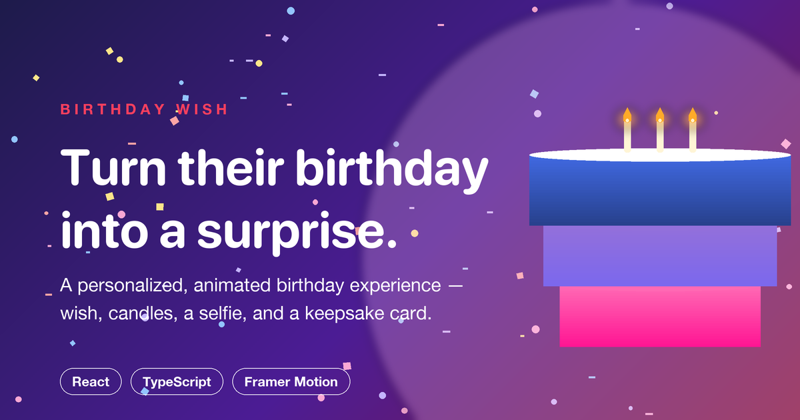

# Birthday Wish

A personalized, animated birthday experience delivered as a single shareable link — a wish, candles to blow out, a selfie with a birthday hat, and a keepsake card to download.



**Live demo:** [your-domain.com](https://your-domain.com) &nbsp;·&nbsp; **Repo:** [github.com/your-username/birthday-wish](https://github.com/your-username/birthday-wish)
> Replace both links above once deployed / pushed.

---

## Overview

Birthday Wish turns a static "happy birthday" message into a small interactive experience. Send someone a link with their name baked in, and they land on a page built just for them: they write a birthday wish, an animated character blows out the candles on their cake, they take a selfie (with a birthday hat composited on top), and the result is assembled into a shareable card they can download as a PNG or PDF.

It's built as a single-page React app with no backend — all personalization comes from URL query parameters, and the keepsake card is rendered and exported entirely client-side.

## Features

- **Personalized landing page** — name and birth date are read from the URL and woven into the copy and animations
- **Animated candle-blowing sequence** — an illustrated character blows out the candles automatically while confetti and balloons animate in
- **Selfie capture** — `getUserMedia` camera access with a birthday-hat overlay composited onto the photo via `<canvas>`; gracefully degrades to a skip option when the camera is unavailable or denied
- **Web Audio "Happy Birthday" melody** — synthesized in-browser, no audio files
- **Downloadable keepsake card** — the final card (wish, photo, name) exports as a PNG or PDF using `html2canvas` + `jsPDF`, rendered through an isolated iframe so the export matches the on-screen design pixel-for-pixel
- **Fully responsive** — tuned for mobile, tablet, and desktop
- **Replay flow** — reset and re-experience the flow without reloading the page

## How it works

1. Open a personalized link (see [Personalizing a link](#personalizing-a-link))
2. Write a birthday wish for the recipient
3. Watch the animated candle-blowing scene
4. Take a selfie (or skip it) — a birthday hat is composited on automatically
5. View the finished birthday card, complete with fireworks and a typewriter-animated wish
6. Download the card as a PNG or PDF, or replay the whole experience

## Personalizing a link

Personalization is passed via query string — no routing or backend required:

```
https://your-domain.com/?name=Alex&bd=July04
```

| Parameter | Aliases | Description | Example |
|---|---|---|---|
| `name` | `user` | The birthday person's name | `Alex` |
| `bd` | `bd_date`, `birthDate` | The birthday date, any free-form string | `July04`, `Feb02`, `Dec25` |

## Tech stack

- **React 18** + **TypeScript**, bundled with **Vite**
- **Tailwind CSS v4** (via `@tailwindcss/vite`) for styling
- **Motion** (Framer Motion) for animation
- **Radix UI** primitives + a `shadcn/ui`-based component library available under `src/components/ui`
- **lucide-react** for icons
- Client-side media pipeline: `getUserMedia`, Canvas 2D, the Web Audio API, `html2canvas`, and `jsPDF`

## Getting started

```bash
npm install
npm run dev      # start the dev server at http://localhost:3000
npm run build    # production build to /dist
```

## Project structure

```
src/
  App.tsx                  # scene orchestration + URL personalization
  components/
    LandingScene.tsx        # wish input
    CandleBlowingScene.tsx   # animated candle-blow sequence
    CameraCapture.tsx        # selfie + birthday-hat overlay
    SurpriseScene.tsx        # final card + PNG/PDF export
    DownloadableCard.tsx      # the exportable card markup (inline-styled for html2canvas)
    ImprovedCake.tsx, Confetti.tsx, Fireworks.tsx,
    FloatingBalloons.tsx, FloatingParticles.tsx, BlowingAvatar.tsx  # decorative effects
    ui/                      # shadcn/ui primitives (available, not all wired up yet)
  styles/globals.css        # design tokens + Tailwind source
public/
  og-image.png, favicon.svg, apple-touch-icon.png
```

## Credits

Built from a Figma Make export. Includes components from [shadcn/ui](https://ui.shadcn.com/) (MIT) — see [`src/Attributions.md`](src/Attributions.md) for full attribution.

---

## Portfolio summary (copy-paste ready)

Use this block as-is when briefing a coding agent to add this project to a portfolio site.

```
Project: Birthday Wish
Tagline: A personalized, animated birthday surprise — delivered as a link.

Description: A single-page React app that turns a birthday message into an
interactive experience. Recipients open a personalized link, write a wish,
watch an animated candle-blowing sequence, take a selfie with a composited
birthday-hat overlay, and receive a keepsake card they can download as a PNG
or PDF — all client-side, no backend.

Tech stack: React, TypeScript, Vite, Tailwind CSS v4, Framer Motion (Motion),
Radix UI / shadcn/ui, lucide-react, Web Audio API, Canvas 2D, html2canvas, jsPDF

Key features:
- URL-based personalization (no login, no backend)
- Camera capture with real-time canvas compositing (birthday hat overlay)
- In-browser synthesized "Happy Birthday" melody via the Web Audio API
- Pixel-accurate PNG/PDF export of a styled card via an isolated iframe + html2canvas
- Fully responsive, animated end-to-end with Framer Motion

Live demo: https://your-domain.com
Repository: https://github.com/your-username/birthday-wish
```
